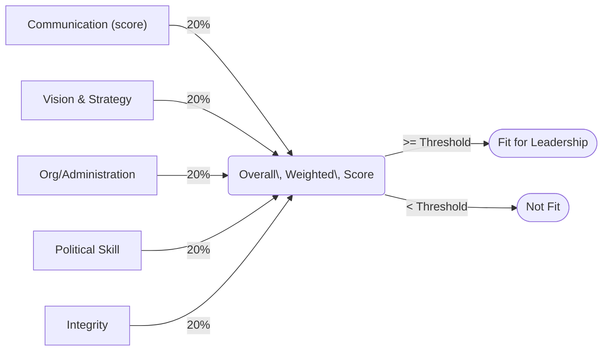

# Executive Summary  
A candidate’s fitness for high office can be assessed across five core dimensions drawn from political science, leadership studies, public administration and ethics.  **Communication & Interpersonal Skill** (the ability to articulate ideas, persuade and empathise) and **Policy Vision & Strategic Orientation** (a clear long-term agenda) echo Fred Greenstein’s classic pillars of presidential leadership (communication to the public; policy vision)【45†L49-L53】【24†L55-L58】.  **Organizational/Administrative Competence** (effective management of government and bureaucracy) and **Political Acumen & Crisis Management** (coalition-building, negotiation and problem-solving under pressure) likewise feature in leadership theories and case studies【45†L49-L53】【61†L418-L426】.  Crucially, **Ethical Integrity** – honesty, transparency and rule-of-law commitment – underpins public trust and is repeatedly rated as the most vital quality【39†L58-L65】【63†L60-L67】.  

Each dimension can be defined and justified through multiple scholarly lenses (e.g. transformational leadership, trait theory, democratic governance) and operationalised by qualitative and quantitative indicators.  For example, communication ability can be measured by expert ratings of debate performance or by public-opinion surveys on message clarity【45†L49-L53】【24†L55-L58】; vision can be proxied by the coherence of policy programmes or fulfilment of campaign promises【54†L55-L58】【60†L1-L4】; managerial capacity by implementation rates or organizational audits【41†L12-L19】【45†L49-L53】; and integrity by absence of corruption findings or public trust metrics【39†L58-L65】【63†L121-L124】.  Weights can then be assigned (e.g. a 0–10 score per dimension, weighted equally or with heavier weight on ethics) and combined into an overall rubric.  A sample scoring flowchart is shown below. 

　【24†L55-L58】【45†L49-L53】  As shown in the comparison table, each measure has distinct strengths (e.g. communication drives consensus) and biases (e.g. charisma may mask lack of substance), and cultural contexts can alter their relative importance.  For instance, high-**power distance** societies may prize stability and loyalty over flamboyant rhetoric, while individualistic democracies emphasise visionary appeals (House et al., 2004).  Policy implications include urging voters and party selectors to use such multidimensional scorecards; for example, media outlets could report candidate scores on these dimensions, and institutions might formalise vetting or training programmes (much as boards vet corporate CEOs)【63†L60-L67】【61†L424-L427】.  

  

| **Measure**                     | **Definition**                                                     | **Indicators/Metrics**                                                                                                           | **Data/Methods**                                                        | **Pros**                                                                      | **Cons/Biases**                                                                                                                      |
|:-------------------------------|:-------------------------------------------------------------------|:-------------------------------------------------------------------------------------------------------------------------------|:-------------------------------------------------------------------------|:----------------------------------------------------------------------------|:-----------------------------------------------------------------------------------------------------------------------------------|
| **Communication & Interpersonal Skill** | Ability to articulate ideas clearly, persuade, listen and empathise.  Key for inspiring citizens and building support【45†L49-L53】【24†L55-L58】. | **Qualitative:** Rhetorical clarity in speeches; empathy/humility (content analysis)【24†L55-L58】【9†L411-L418】; **Quantitative:** Poll ratings for clarity and credibility; media sentiment scores; social-media engagement metrics.  | - Public opinion surveys (e.g. ANES-type) on candidate’s communication. - Expert evaluations (e.g. academic or journalist ratings). - Debate/press-conference transcripts coded for clarity/empathy.   | + Mobilises public, can build consensus (transformational leadership)【24†L55-L58】 + Directly measurable via surveys/statistics. + Critical in crises (symbolic reassurance). | – May favour showmanship over substance (“Teflon” charisma)【61†L459-L464】. – Can be gamed by spin or media-savvy technique. – Biased by cultural style (e.g. direct vs indirect communication).           |
| **Policy Vision & Strategic Orientation** | Clarity of long-term goals and plans.  Involves setting a compelling future direction (Greenstein’s “policy vision”)【45†L49-L53】【24†L55-L58】.  | **Qualitative:** Existence and coherence of published platforms/manifestos; narrative consistency across speeches【60†L1-L4】【61†L459-L464】; **Quantitative:** Number of campaign promises articulated/fulfilled; alignment with socioeconomic forecasts.   | - Content analysis of policy documents and speeches (visionary language)【60†L1-L4】. - Expert scoring of policy platform coherence. - Outcome data (e.g. key indicators versus stated targets).    | + Provides direction and motivation (linked to higher trust)【60†L1-L4】【61†L459-L464】. + Visionary leaders (Mandela, Reagan) often achieve lasting support【61†L459-L464】. + Enables proactive policymaking and planning. | – Vague or abstract visions may mislead (e.g. empty slogans). – Hard to quantify “goodness” of vision; may reflect ideology bias. – Overly rigid vision can hinder adaptability when conditions change.           |
| **Organizational/Administrative Competence** | Effectiveness in managing government machinery: delegation, bureaucracy oversight, and policy implementation【41†L12-L19】【45†L49-L53】.  | **Qualitative:** Expert assessment of governance competence; civil service confidence surveys; **Quantitative:** Rate of legislative agenda implemented; public sector performance indices (e.g. World Bank Government Effectiveness).  | - Administrative data (budget execution, program rollout rates). - Reviews/audits of government efficiency. - Surveys of public servants or stakeholders on managerial skill.             | + Directly affects policy delivery; prevents administrative bottlenecks【41†L12-L19】. + Measurable via performance metrics (e.g. GDP growth, corruption indices). + Emphasized in public administration literature (managerial competence theory). | – Technical competency may not translate to political skill. – May overvalue continuity over innovation (bureaucratic inertia). – Context-dependent (capacity differs by country)【7†L198-L207】.           |
| **Political Acumen & Crisis Management** | Skill in negotiation, coalition-building, conflict resolution and navigating crises【45†L49-L53】【61†L418-L426】. Involves using informal “power” to solve problems. | **Qualitative:** Record of successful bipartisan deals or negotiated agreements; crisis-response narrative quality; **Quantitative:** Legislative success rate (fraction of bills passed); measured stability indicators during crises (e.g. conflict downtime). | - Historical analysis of past negotiations/crisis outcomes (e.g. cabinet support rates). - Expert surveys (political scientists’ ratings of candidate’s savvy). - Network analysis of alliances in parliament. | + Captures real-world problem-solving and leadership under stress【61†L418-L426】. + Crisis-tested leadership often cements legitimacy (e.g. wartime presidents). + Emphasized in contingency/situational leadership theories (Fiedler). | – Success often depends on external factors (e.g. international context). – Difficult to disentangle luck from skill in crises. – Cultural bias: some systems value strongman decisive action over negotiation.           |
| **Ethical Integrity & Values**   | Honesty, consistency of word and deed, commitment to law and fairness【39†L58-L65】【61†L424-L427】.  (Rooted in *ethical* and *transformational* leadership theory【63†L60-L67】.) | **Qualitative:** Vetting of public record for scandals; expert judgements of character; **Quantitative:** Corruption Perception Index (if already in power), number of ethics/code violations; scores on “honesty” in voter surveys. | - Judicial or oversight reports on misconduct. - Transparency data (financial disclosures, asset declarations). - Public trust surveys specifically about integrity (e.g. Pew, Edelman).           | + Most consistently linked to long-term legitimacy; essential for trust (Buffett’s “killer without integrity”【39†L76-L84】). + Predicts follower loyalty and reduces institutional erosion【39†L58-L65】【63†L60-L67】. + Encourages accountability. | – Hard to measure absence of corruption – many violations go unseen. – Perceptions can be skewed by media slant or partisan attacks. – Ethical standards vary: “reality gap” between legal and moral expectations.           |

**1. Communication & Interpersonal Skill** – This covers public speaking, message framing, listening and empathy.  Greenstein identifies “communication to the public” as a chief presidential quality【45†L49-L53】, and leadership textbooks stress that clear articulation of goals mobilises followers. For example, Sheehan & Sheehan (2006) list “effective communication style” as a top characteristic of successful presidents【24†L55-L58】.  High emotional intelligence – the capacity to read audiences and adjust tone – is also critical (Greenstein’s sixth element【7†L198-L207】). Empirical indicators include clarity ratings (e.g. survey respondents’ approval of a leader’s rhetoric), number and reach of speeches, and interactive measures (town halls, media engagement).  Methods include public-opinion polls (e.g. questions on whether a candidate explains ideas clearly), expert workshops, and content analysis of debate transcripts. **Strengths:** Good communicators can unify disparate groups and explain complex policies in persuasive terms, boosting legitimacy.  **Limitations:** Charisma can mask incompetence (“pulpit might make a demagogue”) and be culturally relative (direct styles work in some cultures but not others). Measurement may be biased by media environment or negative campaigning.  

**2. Policy Vision & Strategic Orientation** – This is the candidate’s long-term policy blueprint and ability to formulate a coherent strategy for the future.  A clear national vision (e.g. Greenstein’s “policy vision”) is seen as crucial: leaders who “present a national vision” effectively gain public trust【60†L1-L4】【61†L459-L464】. Transformational leadership theory likewise emphasizes visionary goals as motivational (Bass 1985). Indicators include existence and consistency of a published agenda, clarity of campaign platforms, and expert ratings of strategic soundness.  Quantitative proxies might be the fraction of campaign pledges fulfilled once in office, or alignment of proposals with independent forecasts (e.g. budget gap projections).  Analysts might score vision via expert panels or by keyword analysis (e.g. presence of future-oriented terms). **Strengths:** A well-articulated vision can inspire and coordinate collective action; historically, presidents like Reagan or Mandela leveraged vision to weather crises【61†L459-L464】. **Limitations:** Visions can be vague or opportunistic, and tests of “goodness” are normative; different ideologies value different futures. Vision can also calcify into inflexibility: if reality changes, a rigid strategy may fail.  

**3. Organizational/Administrative Competence** – This dimension gauges capability in managing the executive branch and policy implementation.  It corresponds to Greenstein’s “organizational capacity”【45†L49-L53】. Key aspects include delegation skill and bureaucratic management (Lee & Kim, 2018 define it as the “ability to delegate, supervise, and implement”【41†L12-L19】). Empirical metrics include bureaucratic performance scores (e.g. efficiency or corruption indices), the percentage of policy initiatives executed, and civil service survey feedback.  Data sources are administrative records (audit reports, implementation timelines) and large surveys of public employees or stakeholders.  Behavioral tests might involve simulations of crisis management or interview assessments. **Strengths:** Ensures that declared policies actually translate into outcomes; effective managers can prevent leaks and scandals. **Limitations:** May be overstated if the candidate lacks political support; some systems separate technocratic skills from elected leadership. Measurement can be culturally biased (Western criteria may not fit other governance models), and data are often lagging indicators (results appear only after time).  

**4. Political Acumen & Crisis Management** – This reflects skill in negotiation, coalition-building, problem-solving under pressure, and crisis leadership.  Greenstein calls this “political skill”【45†L49-L53】, and Lee/Kim (2018) highlight “political power” – the ability to resolve conflicts and show determination in crises【61†L418-L426】.  Indicators include legislative success rate (e.g. share of executive-sponsored bills passed), number of bipartisan deals brokered, or network measures of coalition strength. Qualitative cues are performance in real crises (wars, economic shocks) and peer evaluations of savvy. Methods include expert surveys and historical case analysis (how effectively the candidate managed past disputes), as well as psychological leadership simulations (assessing decision-making styles).  **Strengths:** Captures adaptive problem-solving and the “nuts-and-bolts” of governance; effective crisis managers (e.g. wartime or post-disaster presidents) often secure high public approval.  **Limitations:** Outcomes heavily depend on context (an easy situation can make any leader look good). Achievements may owe much to luck or institutions. Also, over-emphasis on forceful resolution can underrate deliberative or consensus approaches. Cultural caveat: some electorates prefer strong decisive action (even authoritarian) while others value deliberation.  

**5. Ethical Integrity & Values** – Encompasses honesty, personal honor and commitment to the rule of law.  Leadership research repeatedly finds integrity to be foundational: one systematic review notes “academics and industry experts prioritize integrity as the most important leadership quality”【39†L58-L65】. Buff­ett’s dictum is echoed in political terms – a president’s lack of principle erodes trust【61†L424-L427】.  Quantitative measures include corruption indices (Corruption Perceptions Index, etc.), frequency of ethics investigations, or breaches of transparency laws. Public surveys asking voters how much they trust a candidate to “do what is right” are also used.  Qualitatively, background checks, past records, and moral leadership assessments (based on consis­tency of speech and action) are key. Methods range from forensic audit (checking financial disclosures) to psychological tests of moral reasoning. **Strengths:** High integrity builds legitimacy and stability. Ethical leaders “set the tone at the top” and gradually restore trust【63†L60-L67】. This dimension often has the strongest effect on citizen confidence【63†L121-L124】【39†L76-L84】. **Limitations:** It is hardest to measure objectively – “absence of evidence” is not “evidence of absence” of corruption. Perceptions can be distorted by biased media or smear campaigns. Cultural-context caveat: norms differ (e.g. gift-giving is normal in some cultures but taboo in others), and some electorates may forgive ethical lapses if linked to charisma.  

**Combining Measures (Rubric):**  A composite score can be built by rating each dimension on a consistent scale (e.g. 0–10 or 1–5) and applying weights.  Weights may be equal or tilted (for instance, giving extra weight to Integrity because of its central role in democracy【39†L58-L65】【61†L424-L427】).  For example, one could assign 20% to each dimension and set an overall fit-threshold (see flowchart).  A candidate might be deemed *“Strongly Fit”* if the weighted sum exceeds a threshold (e.g. 80/100) and has no fatal weaknesses (e.g. integrity score >8), *“Weak Fit”* if well below, or *“Marginal”* in between.  A mermaid flowchart illustrating this scoring approach is shown above.  In practice, rubric thresholds should be calibrated by historical analysis of past leaders.  **Strengths of combined scoring:** balances multiple angles, reduces single-factor bias. **Limitations:** Aggregating disparate qualities is inherently subjective (choosing weights involves normative judgment). Scores can mask important nuances (e.g. a candidate strong in 4 areas but scandal-ridden in integrity might score moderately). Expert panels and transparency in scoring can mitigate arbitrariness.  

**Cross-Cultural & Contextual Caveats:**  The relative importance and expression of these measures vary by country and culture.  For instance, *“charismatic communication”* is prized in individualistic, low power-distance societies, while high-context cultures might prefer reserved eloquence and group harmony (empathy and consensus-building over bombastic speeches).  Similarly, *“integrity”* has universal appeal, but what constitutes ethical leadership can differ (e.g. patronage politics might be accepted in some developing states but condemned elsewhere). Comparative leadership surveys (e.g. GLOBE project) find some universals (vision and integrity often rank high everywhere) but also culture-specific traits (humility is more valued in Confucian cultures, for example).  Any scoring rubric must be applied with local calibration: constitutional systems differ (parliamentary vs presidential) and history shapes expectations (e.g. revolutionary countries may value transformative mission more than incremental stability).  Moreover, data availability varies – a candidate in an opaque regime may have little measurable record.  It is important to interpret scores “relatively” (how a candidate stands within his context) rather than assume cross-system comparability.  

**Policy Implications:**  For voters and civil society, these measures suggest an informational *scorecard* approach to evaluating candidates.  Media and NGOs could survey or fact-check candidates on these dimensions (e.g. publish “scores” for debate performance, policy clarity, anti-corruption pledges, etc.).  Parties and primaries could institutionalise leadership assessments: for example, requiring candidates to undergo vetting on ethics and competence (analogous to corporate CEO vetting) or to present detailed strategic plans.  Leadership development programs (already used in business) might be adapted for politicians, to strengthen weaker dimensions (e.g. communication training or crisis simulation workshops). Electoral laws could mandate disclosure (financial assets, conflict of interest statements) linked to the integrity criterion.  Finally, at the institutional level, mechanisms like independent ethics commissions or legislative oversight (judiciary, ombudsmen) help hold leaders to these standards.  In short, a multi-criteria “fitness” framework encourages more holistic candidate scrutiny, which could improve democratic choice and institutional resilience【63†L60-L67】【61†L424-L427】.  

**Sources:** Established studies of presidential leadership (Greenstein 2000【45†L49-L53】; Northouse 2016【24†L55-L58】), comparative leadership surveys, and empirical research on trust (Lee & Kim 2018【61†L418-L426】; Nawaz et al. 2023【39†L58-L65】; Mozumder 2021【63†L60-L67】).  The above synthesis draws on political science, psychology and management literatures, combining normative leadership theory with measurable indicators【61†L429-L434】【39†L76-L84】.