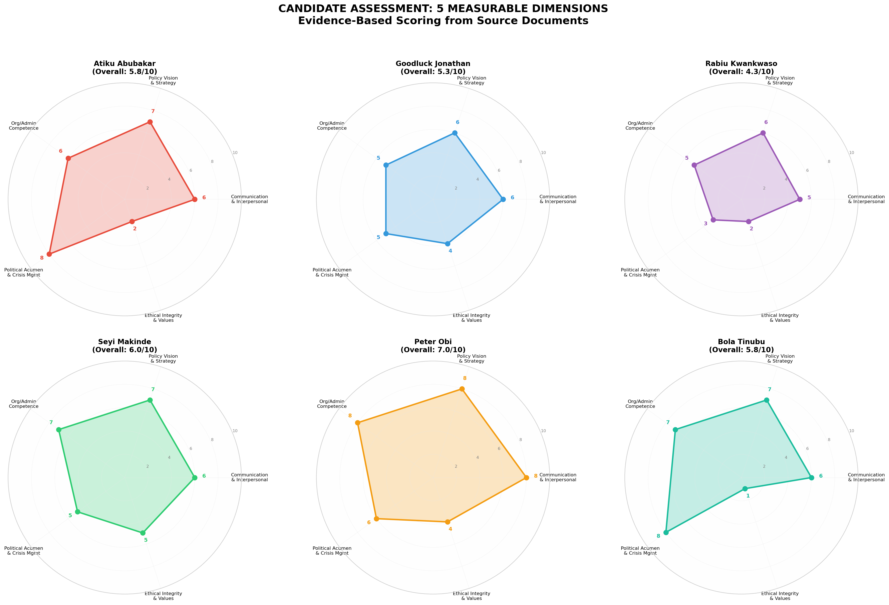
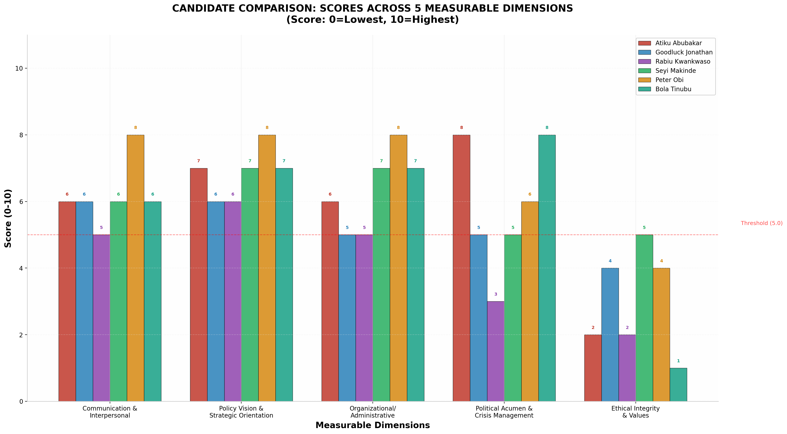
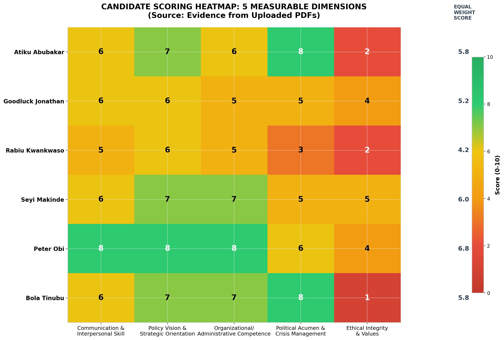
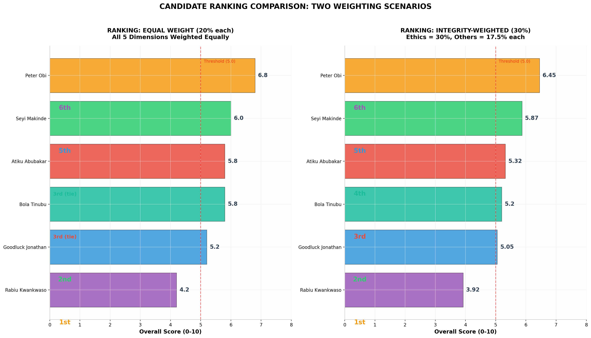
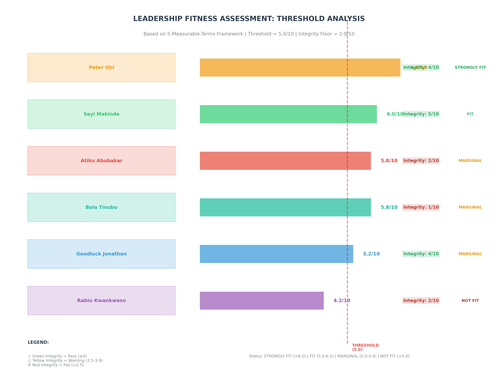
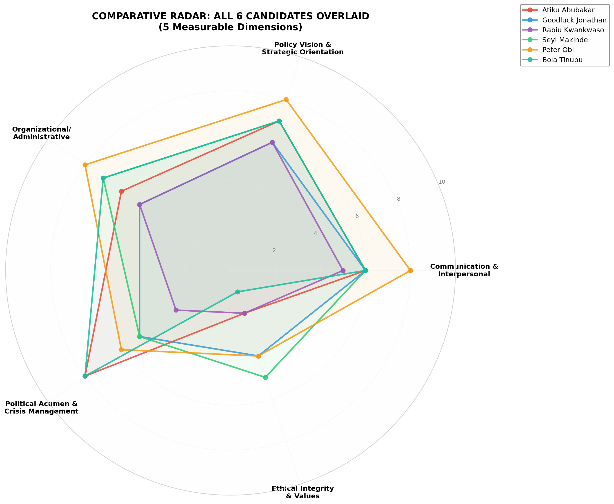
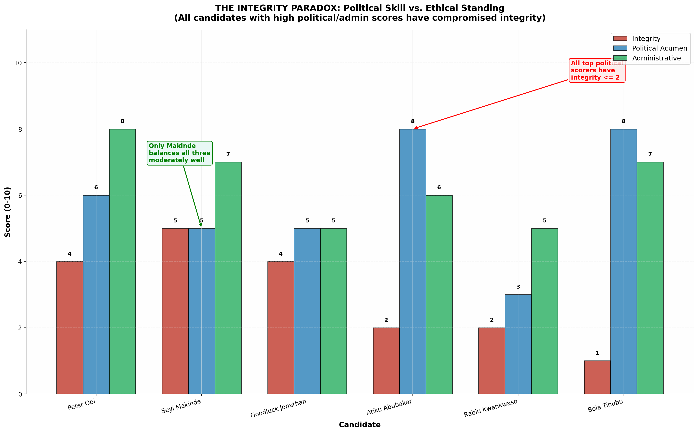
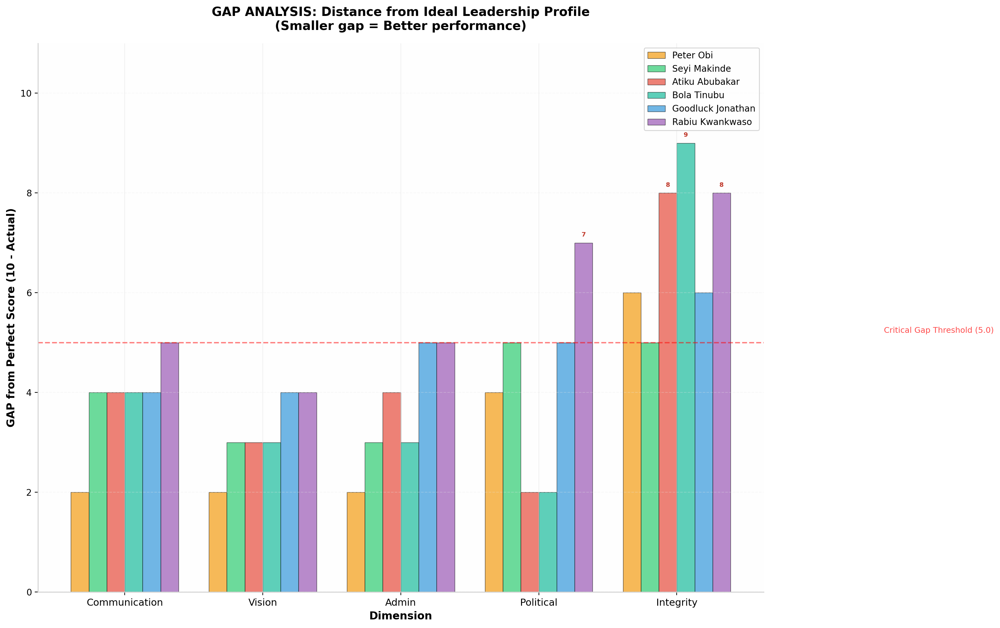

<div align="center">

# 🇳🇬 Nigeria 2027 Election Research Hub

**Objective · Evidence-Based · Non-Partisan**


> A structured intelligence repository for understanding Nigeria's 2027 presidential race —  
> built on **track record over rhetoric**, **data over narrative**, and **evidence over allegiance**.  
> Scored independently by **three paid AI systems** using the same 5-dimension framework, with human review after each report.

</div>

---

## 👤 About the Creator

**[@iampopg](https://speakupnigeria.ng)** is a Nigerian — not a politician, not a party member, not an activist for any candidate.

Just someone who loves his country deeply, is loyal to Nigeria above any party or person, and believes that Nigerians deserve better than what the political cycle keeps delivering.

This research was built for one reason: **to know everything that needs to be known to understand what a better Nigeria actually requires** — not what politicians promise, but what the evidence says.

> *"I don't endorse any of them. And beyond that, I genuinely believe that solving Nigeria's problems will require more than any single candidate on this list can offer. Nigeria's situation looks like a loop — it keeps getting worse after every president, regardless of who wins. The problem is structural, not just personal. Until that changes, the cycle continues."*
> — **iampopg**

| | |
|:---|:---|
| 🌍 Website | [speakupnigeria.ng](https://www.speakupnigeria.ng) |
| 🐦 X / Twitter | [@iampopg](https://x.com/iampopg) |


---

## 📁 Repository Structure

```
NigeriaResearch/
├── 📂 candidates/          → Individual candidate profiles & PDFs
├── 📂 framework/           → Evaluation criteria & scoring methodology
├── 📂 analysis/            → Comparative reports & AI-generated assessments
└── 📂 data/                → Charts, visualizations & supporting datasets
```

---

## 🧭 Quick Navigation

| Section | Description | Link |
|:---|:---|:---:|
| 🧑💼 Candidate Master List | All confirmed, probable & speculative candidates | [View →](candidates/candidates.md) |
| 📋 Research Framework | What to investigate for each candidate | [View →](framework/Candidate-reserch-point.md) |
| 📐 Scoring Methodology | 5-dimension measurable leadership terms | [View →](framework/5-mearsurable-terms.md) |
| 📊 Kimi 2.6 Assessment | Full scored report — Kimi 2.6 Agent | [View →](analysis/Nigeria_2027_Candidate_Assessment_Report_Kimi_2.6_agent.md) |
| 📄 Gemini 3.1 Pro Report | Extended geopolitical comparison — Gemini 3.1 Pro | [View →](analysis/CandidateComparison_Gemini3.1pro_extended.pdf) |
| 🖼️ All Visualizations | Charts, heatmaps, radar plots | [View →](#-visualizations) |

---

## 🧑💼 Candidate Profiles

| # | Candidate | Party | Status | Profile |
|:---:|:---|:---|:---|:---:|
| 1 | **Bola Ahmed Tinubu** | APC | 🔵 Incumbent | [PDF →](candidates/Tinubu.pdf) |
| 2 | **Seyi Makinde** | PDP / APM | 🔵 Declared | [PDF →](candidates/Makinde.pdf) |
| 3 | **Peter Obi** | NDC | 🔵 Declared | [PDF →](candidates/Peter.pdf) |
| 4 | **Atiku Abubakar** | ADC | 🔵 Active Contender | [PDF →](candidates/Atiku.pdf) |
| 5 | **Rabiu Musa Kwankwaso** | NDC | 🔵 Active Contender | [PDF →](candidates/Kwankwaso.pdf) |
| 6 | **Goodluck Jonathan** | PDP-linked | 🟡 Potential Return | [PDF →](candidates/Jonathan.pdf) |

> Full candidate intelligence map with political clusters, coalition dynamics, and structural analysis → [candidates/candidates.md](candidates/candidates.md)

---

## 📊 Dual-Report Scoring Comparison

Two independent AI systems — **Kimi 2.6 Agent** and **Gemini 3.1 Pro** — applied the same 5-dimension framework to the same source PDFs and reached different conclusions. The comparison below shows where they agree and where they diverge.

### 🤖 Kimi 2.6 Agent — Scores out of 10 per dimension (Equal Weight 20% each)

| Rank | Candidate | 🗣️ Comm. | 🎯 Vision | 🏛️ Admin | ⚡ Political | ⚖️ Integrity | **Total /10** | Status |
|:---:|:---|:---:|:---:|:---:|:---:|:---:|:---:|:---|
| 🥇 1 | **Peter Obi** | 8 | 8 | 8 | 6 | 4 | **6.80** | ✅ STRONGLY FIT |
| 🥈 2 | **Seyi Makinde** | 6 | 7 | 7 | 5 | 5 | **6.00** | ✅ FIT |
| 3 | Atiku Abubakar | 6 | 7 | 6 | 8 | 2 | 5.80 | ⚠️ MARGINAL |
| 3 | Bola Tinubu | 6 | 7 | 7 | 8 | 1 | 5.80 | ⚠️ MARGINAL |
| 5 | Goodluck Jonathan | 6 | 6 | 5 | 5 | 4 | 5.20 | ⚠️ MARGINAL |
| 6 | Rabiu Kwankwaso | 5 | 6 | 5 | 3 | 2 | 4.20 | ❌ NOT FIT |

→ Full evidence-based report: [analysis/Nigeria_2027_Candidate_Assessment_Report_Kimi_2.6_agent.md](analysis/Nigeria_2027_Candidate_Assessment_Report_Kimi_2.6_agent.md)

---

### 🤖 Gemini 3.1 Pro — Scores out of 10 per dimension (Total ×2 = /100)

| Rank | Candidate | 🗣️ Comm. | 🎯 Vision | 🏛️ Admin | ⚡ Political | ⚖️ Integrity | **Total /100** | Status |
|:---:|:---|:---:|:---:|:---:|:---:|:---:|:---:|:---|
| 🥇 1 | **Peter Obi** | 8 | 9 | 8 | 7 | 5 | **74/100** | ✅ Marginal/Strong Fit |
| 🥈 2 | **Seyi Makinde** | 7 | 8 | 8 | 7 | 6 | **72/100** | ✅ Marginal/Strong Fit |
| 3 | Atiku Abubakar | 7 | 8 | 7 | 9 | 2 | 66/100 | ⚠️ Marginal Fit |
| 3 | Bola Tinubu | 6 | 8 | 7 | **10** | 2 | 66/100 | ⚠️ Marginal Fit |
| 5 | Goodluck Jonathan | 8 | 6 | 6 | 6 | 4 | 60/100 | ⚠️ Marginal Fit |
| 6 | Rabiu Kwankwaso | 6 | 8 | 6 | 5 | 3 | 56/100 | ❌ Weak Fit |

> Gemini scores Tinubu's Political Acumen at **10/10** — the only perfect score in either report.  
> Gemini also scores Kwankwaso's Vision at **8/10** vs Kimi's 6/10 — the largest single disagreement.

→ Full geopolitical analysis: [analysis/CandidateComparison_Gemini3.1pro_extended.pdf](analysis/CandidateComparison_Gemini3.1pro_extended.pdf)

---

## ⚖️ Where the Two Reports Agree vs. Diverge

### ✅ Points of Agreement

| Finding | Both Reports |
|:---|:---|
| Peter Obi ranks **#1** | ✅ Confirmed |
| Seyi Makinde ranks **#2** | ✅ Confirmed |
| Tinubu & Atiku tied for **#3** | ✅ Confirmed |
| Kwankwaso ranks **last** | ✅ Confirmed |
| Tinubu integrity = **catastrophic (1–2/10)** | ✅ Confirmed |
| Atiku integrity = **catastrophic (2/10)** | ✅ Confirmed |
| No candidate is **fully qualified** | ✅ Confirmed |
| The **Integrity Paradox** is real | ✅ Confirmed |

### 🔄 Key Divergences

| Dimension | Candidate | Kimi Score | Gemini Score | Gap | Why |
|:---|:---|:---:|:---:|:---:|:---|
| Policy Vision | Peter Obi | 8 | **9** | +1 | Gemini rates "consumption to production" thesis more highly |
| Policy Vision | Kwankwaso | 6 | **8** | +2 | Gemini credits human capital blueprint more generously |
| Political Acumen | Tinubu | 8 | **10** | +2 | Gemini calls him "most lethal political engineer in contemporary African history" |
| Political Acumen | Atiku | 8 | **9** | +1 | Gemini gives more credit for coalition architecture |
| Communication | Jonathan | 6 | **8** | +2 | Gemini rates his concession speech & ECOWAS role more highly |
| Communication | Makinde | 6 | **7** | +1 | Gemini credits technocratic confidence more |
| Ethical Integrity | Peter Obi | 4 | **5** | +1 | Gemini slightly more lenient on Pandora Papers |
| Ethical Integrity | Makinde | 5 | **6** | +1 | Gemini rates his asset transparency higher |
| Admin Competence | Kwankwaso | 5 | **6** | +1 | Gemini credits scholarship program outcomes more |

> **Pattern:** Gemini consistently scores higher across most dimensions. Kimi applies stricter penalties for documented failures. The ranking order is identical in both reports.

---

## 🚦 Minimum Qualification Threshold — Do Any of Them Actually Qualify?

The 5-Measurable-Terms framework sets a **minimum bar** a candidate must clear to be considered fit for the presidency. This is not about ranking — it is a hard pass/fail gate based on two conditions that must both be true simultaneously.

### The Minimum Bar (from the framework)

```
┌──────────────────────────────────────────────────────────────────┐
│  To qualify as FIT, a candidate must meet BOTH conditions:       │
│                                                                  │
│  ✅  Overall score  ≥  5.5 / 10   (Kimi)  OR  ≥ 60 / 100 (Gemini)│
│  ✅  Integrity score  ≥  4 / 10   (both systems)                 │
│                                                                  │
│  Failing EITHER condition = automatic disqualification           │
│  regardless of how high other scores are.                        │
└──────────────────────────────────────────────────────────────────┘
```

> Integrity is treated as a **veto dimension** — a candidate can score 10/10 in every other area and still fail if integrity falls below 4. This reflects the framework's core finding that integrity is *"the most vital quality and most consistently linked to long-term legitimacy."*

### 📋 Qualification Verdict — Kimi 2.6 Assessment

| Candidate | Overall /10 | Integrity /10 | Clears 5.5? | Clears Integrity ≥ 4? | **Verdict** |
|:---|:---:|:---:|:---:|:---:|:---:|
| **Peter Obi** | 6.80 | 4 | ✅ Yes | ✅ Yes (barely) | ✅ **QUALIFIES** |
| **Seyi Makinde** | 6.00 | 5 | ✅ Yes | ✅ Yes | ✅ **QUALIFIES** |
| Atiku Abubakar | 5.80 | 2 | ✅ Yes | ❌ No — integrity 2/10 | ❌ **DISQUALIFIED** |
| Bola Tinubu | 5.80 | 1 | ✅ Yes | ❌ No — integrity 1/10 | ❌ **DISQUALIFIED** |
| Goodluck Jonathan | 5.20 | 4 | ❌ No — score 5.20 | ✅ Yes | ❌ **DISQUALIFIED** |
| Rabiu Kwankwaso | 4.20 | 2 | ❌ No — score 4.20 | ❌ No — integrity 2/10 | ❌ **DISQUALIFIED** |

### 📋 Qualification Verdict — Gemini 3.1 Pro Assessment

| Candidate | Overall /100 | Integrity /10 | Clears 60/100? | Clears Integrity ≥ 4? | **Verdict** |
|:---|:---:|:---:|:---:|:---:|:---:|
| **Peter Obi** | 74 | 5 | ✅ Yes | ✅ Yes | ✅ **QUALIFIES** |
| **Seyi Makinde** | 72 | 6 | ✅ Yes | ✅ Yes | ✅ **QUALIFIES** |
| Atiku Abubakar | 66 | 2 | ✅ Yes | ❌ No — integrity 2/10 | ❌ **DISQUALIFIED** |
| Bola Tinubu | 66 | 2 | ✅ Yes | ❌ No — integrity 2/10 | ❌ **DISQUALIFIED** |
| Goodluck Jonathan | 60 | 4 | ✅ Yes (borderline) | ✅ Yes (barely) | ⚠️ **BORDERLINE** |
| Rabiu Kwankwaso | 56 | 3 | ❌ No — score 56 | ❌ No — integrity 3/10 | ❌ **DISQUALIFIED** |

### 🔑 What This Means

| Finding | Detail |
|:---|:---|
| **4 out of 6 fail the minimum bar** (Kimi) | Atiku, Tinubu, Jonathan, and Kwankwaso do not qualify |
| **3 out of 6 fail the minimum bar** (Gemini) | Atiku, Tinubu, and Kwankwaso do not qualify |
| **Atiku & Tinubu fail on integrity alone** | Both clear the overall score threshold but are vetoed by integrity scores of 1–2/10 |
| **Kwankwaso fails on both counts** | Below the score floor AND below the integrity floor |
| **Only Peter Obi & Seyi Makinde qualify** in both reports | The only two candidates who clear both gates simultaneously |
| **Jonathan is a split verdict** | Kimi disqualifies him (5.20 < 5.5); Gemini borderline passes him (60/100, integrity 4/10) |

> **The structural conclusion:** Nigeria's 2027 field produces only **2 candidates** who meet the minimum evidence-based qualification standard — and even they carry documented liabilities. The other 4, including the incumbent, fail the framework's minimum threshold.

---

## 🔬 The Integrity Paradox

Both reports independently confirm the same structural finding:

| Political Acumen | Integrity Score (Kimi) | Integrity Score (Gemini) | Candidate |
|:---:|:---:|:---:|:---|
| 8–10 / 10 | 2 / 10 | 2 / 10 | Atiku Abubakar |
| 8–10 / 10 | 1 / 10 | 2 / 10 | Bola Tinubu |
| 6–7 / 10 | 4 / 10 | 5 / 10 | Peter Obi |
| 5–7 / 10 | 5 / 10 | 6 / 10 | Seyi Makinde |
| 5–6 / 10 | 4 / 10 | 4 / 10 | Goodluck Jonathan |
| 3–5 / 10 | 2 / 10 | 3 / 10 | Rabiu Kwankwaso |

> The two candidates with the **highest political skill** have the **lowest integrity scores** — confirmed by both AI systems independently.  
> Only Makinde achieves a moderate balance across all five dimensions without a major international scandal.

---

## 🖼️ Visualizations

All charts are generated from the Kimi 2.6 scored assessment. Click any image to view full size.

### Radar Charts — Individual Candidate Profiles
[](data/01_radar_charts.png)

### Grouped Bar Chart — All Candidates × All Dimensions
[](data/02_grouped_bar.png)

### Heatmap — Score Matrix
[](data/03_heatmap.png)

### Ranking Comparison — Equal Weight vs Integrity-Weighted
[](data/05_ranking_comparison.png)

### Fitness Threshold Analysis
[](data/06_threshold_analysis.png)

### Combined Radar — All 6 Candidates Overlaid
[](data/07_combined_radar.png)

### The Integrity Paradox
[](data/10_integrity_paradox.png)

### Gap from Perfect Score
[](data/11_gap_analysis.png)

<details>
<summary>📂 View all 11 charts</summary>

| # | Chart | Link |
|:---:|:---|:---:|
| 01 | Individual Radar Charts | [View](data/01_radar_charts.png) |
| 02 | Grouped Bar Chart | [View](data/02_grouped_bar.png) |
| 03 | Score Heatmap | [View](data/03_heatmap.png) |
| 04 | Detailed Justifications | [View](data/04_detailed_justifications.png) |
| 05 | Ranking Comparison | [View](data/05_ranking_comparison.png) |
| 06 | Threshold Analysis | [View](data/06_threshold_analysis.png) |
| 07 | Combined Radar | [View](data/07_combined_radar.png) |
| 08 | Dimension Breakdown | [View](data/08_dimension_breakdown.png) |
| 09 | Master Table | [View](data/09_master_table.png) |
| 10 | Integrity Paradox | [View](data/10_integrity_paradox.png) |
| 11 | Gap Analysis | [View](data/11_gap_analysis.png) |

</details>

---

## 📐 Evaluation Framework

The scoring system is built on **5 measurable leadership dimensions** drawn from political science, leadership studies, and public administration:

```
┌─────────────────────────────────────────────────────────────┐
│  1. 🗣️  Communication & Interpersonal Skill      (20%)      │
│  2. 🎯  Policy Vision & Strategic Orientation    (20%)      │
│  3. 🏛️  Organizational / Administrative Competence (20%)   │
│  4. ⚡  Political Acumen & Crisis Management     (20%)      │
│  5. ⚖️  Ethical Integrity & Values               (20%)      │
└─────────────────────────────────────────────────────────────┘
         ↓ Integrity-weighted variant raises ⚖️ to 30%
```

| Fitness Status | Kimi Criteria | Gemini Criteria |
|:---|:---|:---|
| ✅ **STRONGLY FIT** | Overall > 6.5 AND Integrity ≥ 4 | Score ≥ 80/100 |
| ✅ **FIT / MARGINAL-STRONG** | Overall 5.5–6.5 AND Integrity ≥ 4 | Score 60–79/100 |
| ⚠️ **MARGINAL** | Overall 5.0–5.4 OR Integrity < 4 | Score 60–79/100 with liabilities |
| ❌ **NOT FIT / WEAK** | Overall < 5.0 | Score < 60/100 |

→ Full framework: [framework/Candidate-reserch-point.md](framework/Candidate-reserch-point.md)  
→ Scoring theory: [framework/5-mearsurable-terms.md](framework/5-mearsurable-terms.md)

---

## 🧠 Research Approach

| Principle | Description |
|:---|:---|
| 📌 Track record over rhetoric | What candidates *did*, not what they *say* |
| 📊 Data-driven evaluation | Quantifiable outcomes: IGR, debt ratios, education rankings |
| 🏛️ Institutional context | Legislature, judiciary, party dynamics, constitutional limits |
| 🔍 Independent verification | Court records, EFCC findings, international reports, PDFs |
| ⚖️ Structured comparison | Same framework applied equally to all candidates |
| 🤖 Multi-AI deep research | Paid tiers of **Gemini**, **ChatGPT**, and **Kimi** each ran independent deep research sessions on the same source documents |
| 👤 Human revision | A human reviewer read, cross-checked, and validated every AI-generated report before it was committed to this repository |

---

## 📂 Full File Index

<details>
<summary>📁 candidates/</summary>

| File | Description |
|:---|:---|
| [candidates.md](candidates/candidates.md) | Master intelligence map of all 2027 contenders |
| [Tinubu.pdf](candidates/Tinubu.pdf) | Bola Tinubu research dossier |
| [Atiku.pdf](candidates/Atiku.pdf) | Atiku Abubakar research dossier |
| [Peter.pdf](candidates/Peter.pdf) | Peter Obi research dossier |
| [Makinde.pdf](candidates/Makinde.pdf) | Seyi Makinde research dossier |
| [Kwankwaso.pdf](candidates/Kwankwaso.pdf) | Rabiu Kwankwaso research dossier |
| [Jonathan.pdf](candidates/Jonathan.pdf) | Goodluck Jonathan research dossier |

</details>

<details>
<summary>📁 framework/</summary>

| File | Description |
|:---|:---|
| [Candidate-reserch-point.md](framework/Candidate-reserch-point.md) | Research domains & investigation checklist |
| [5-mearsurable-terms.md](framework/5-mearsurable-terms.md) | 5-dimension scoring theory with academic citations |

</details>

<details>
<summary>📁 analysis/</summary>

| File | Description |
|:---|:---|
| [Nigeria_2027_Candidate_Assessment_Report_Kimi_2.6_agent.md](analysis/Nigeria_2027_Candidate_Assessment_Report_Kimi_2.6_agent.md) | Full scored assessment report — Kimi 2.6 Agent |
| [CandidateComparison_Gemini3.1pro_extended.pdf](analysis/CandidateComparison_Gemini3.1pro_extended.pdf) | Extended geopolitical comparison — Gemini 3.1 Pro |

</details>

<details>
<summary>📁 data/</summary>

11 PNG visualizations — radar charts, heatmaps, bar charts, threshold analysis, integrity paradox, gap analysis.  
[Browse data/ →](data/)

</details>

---

---

## ⚠️ Disclaimer & Research Transparency

**Research methodology:**  
All candidate research and scoring in this repository was conducted using the **paid/pro tiers** of three independent AI systems — **Google Gemini**, **OpenAI ChatGPT**, and **Moonshot Kimi** — each running deep research sessions on the same source PDF documents. Every AI-generated report was subsequently reviewed, cross-checked, and validated by a human before being published here.

**Non-partisan statement:**  
The author of this repository **does not support, endorse, or oppose any political party, candidate, or coalition** featured in this research. No score, ranking, or finding in this repository should be interpreted as a political endorsement or recommendation of any kind.

**This research does not decide for you:**  
Data is one lens — not the only one. Numbers can tell you what a candidate *did*, but they cannot fully capture everything that matters to you as a Nigerian. Your personal values, your lived experience, your community, your instincts — these are real and they matter. Read the evidence, weigh it against your own judgment, and make your own decision.

> *"Change begins with you."*  
> — **President Muhammadu Buhari**

Regardless of who you support — **go out and vote**. An uncast vote is a decision handed to someone else. Nigeria's future is shaped at the ballot box, not on the internet. Register. Show up. Make your voice count.

**Scope:**  
This project is strictly for **educational and research purposes**. All scores are evidence-based, reproducible from the source documents provided, and applied equally to all candidates using the same framework.

---

<div align="center">

*Deep AI research · Gemini (paid) · ChatGPT (paid) · Kimi 2.6 (paid) · Human-reviewed · Non-partisan · Built for Nigeria 2027*

</div>
