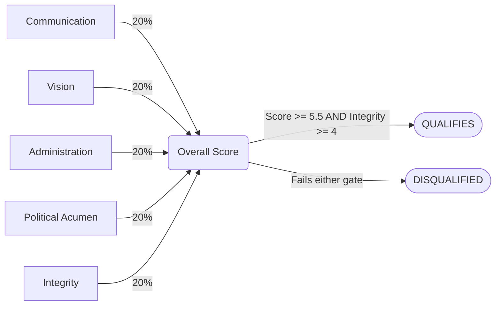

# 📐 The 5 Measurable Terms — Leadership Scoring Framework

> This framework defines how every candidate in this research is evaluated.  
> It is drawn from political science, leadership studies, public administration, and ethics scholarship.  
> The same framework was applied equally to all candidates, by all three AI systems.

---

## Why This Framework Exists

Evaluating a presidential candidate is not about gut feeling, tribal loyalty, or campaign promises.  
It is about **what they actually did** when they had power — and whether the evidence suggests they can be trusted with more of it.

This framework converts that question into five measurable dimensions, each scored from **0 to 10**, combined into a weighted total, and tested against a minimum qualification threshold.

---

## The 5 Dimensions at a Glance

```
┌─────────────────────────────────────────────────────────────────┐
│                                                                 │
│   1. 🗣️  Communication & Interpersonal Skill        (20%)      │
│   2. 🎯  Policy Vision & Strategic Orientation      (20%)      │
│   3. 🏛️  Organizational / Administrative Competence (20%)      │
│   4. ⚡  Political Acumen & Crisis Management        (20%)      │
│   5. ⚖️  Ethical Integrity & Values                 (20%)      │
│                                                                 │
│         Equal weight = 20% each → Total out of 10              │
│         Integrity-weighted variant → Integrity raised to 30%   │
│                                                                 │
└─────────────────────────────────────────────────────────────────┘
```

---

## Scoring Flow



---

## Fitness Thresholds

| Status | Criteria |
|:---|:---|
| ✅ **Strongly Fit** | Overall > 6.5 **AND** Integrity ≥ 4 |
| ✅ **Fit** | Overall 5.5–6.5 **AND** Integrity ≥ 4 |
| ⚠️ **Marginal** | Overall 5.0–5.4 **OR** Integrity < 4 |
| ❌ **Not Fit** | Overall < 5.0 |

> **Integrity is a veto dimension.**  
> A candidate can score 10/10 in every other area and still be disqualified if their integrity score falls below 4.  
> This reflects the consistent finding in leadership research that integrity is *"the most vital quality and most consistently linked to long-term legitimacy."*

---

## The 5 Dimensions — Full Breakdown

---

### 1. 🗣️ Communication & Interpersonal Skill

**What it measures:**  
The ability to articulate ideas clearly, persuade, listen, and connect with people — from grassroots voters to international partners.

**Why it matters:**  
A leader who cannot communicate cannot govern. Communication drives public trust, crisis reassurance, coalition-building, and the ability to explain difficult decisions to ordinary people.

**What counts as evidence:**
- Clarity and consistency of public speeches and messaging
- Ability to connect emotionally with different audiences
- Performance during crises — does the leader reassure or inflame?
- Track record in negotiations and interpersonal diplomacy
- Media engagement, town halls, press conferences

**Strengths of this measure:**
- Directly observable and measurable
- Critical during national emergencies
- Drives public mobilization and consensus

**Limitations:**
- Charisma can mask incompetence — a great speaker is not automatically a great leader
- Can be gamed by media-savvy spin
- Communication styles vary by culture; what works in Lagos may not work in Kano

---

### 2. 🎯 Policy Vision & Strategic Orientation

**What it measures:**  
The clarity, coherence, and realism of a candidate's long-term plan for the country — not slogans, but an actual blueprint.

**Why it matters:**  
A president without a clear vision is reactive, not proactive. Vision determines what a government prioritizes, how it allocates resources, and whether it has a direction beyond surviving the next election cycle.

**What counts as evidence:**
- Published manifesto or policy platform — does it exist? Is it detailed?
- Consistency between what was promised and what was delivered in past roles
- Alignment of proposals with Nigeria's actual economic and structural realities
- Long-term thinking vs. short-term populism

**Strengths of this measure:**
- Provides a testable standard — promises can be checked against outcomes
- Visionary leaders historically achieve more durable results
- Enables proactive policymaking rather than crisis management

**Limitations:**
- Vague visions are easy to fake — slogans are not strategy
- Overly rigid vision can become a liability when circumstances change
- "Goodness" of a vision is partly subjective and ideologically influenced

---

### 3. 🏛️ Organizational / Administrative Competence

**What it measures:**  
The ability to actually run a government — managing people, delegating effectively, executing policy, and delivering results through institutions.

**Why it matters:**  
This is the most empirical dimension. It answers the question: when this person had power before, did things actually get better? IGR growth, debt management, infrastructure delivery, education outcomes, healthcare metrics — these are the receipts.

**What counts as evidence:**
- Revenue generation and fiscal management during previous office
- Infrastructure delivery — roads, power, hospitals, schools built or completed
- Debt profile — did they leave the state/country better or worse off financially?
- Education and health outcome metrics during tenure
- Audit reports, budget execution rates, institutional reforms implemented

**Strengths of this measure:**
- Most objective and data-driven of all five dimensions
- Directly tied to real outcomes for real people
- Hard to fake — the numbers either improved or they didn't

**Limitations:**
- Technical competence does not always translate to political survival
- Some results take years to show — a leader may plant seeds they never harvest
- External factors (oil prices, global recessions) can distort outcomes

---

### 4. ⚡ Political Acumen & Crisis Management

**What it measures:**  
The raw political skill to navigate Nigeria's complex, high-stakes institutional environment — building coalitions, surviving attacks, managing crises, and getting things done despite opposition.

**Why it matters:**  
Nigeria's political system is not a clean meritocracy. A candidate who cannot survive its pressures, build alliances across regions, and manage crises under fire will not be able to govern effectively — regardless of how good their intentions are.

**What counts as evidence:**
- Coalition-building across ethnic, regional, and party lines
- Survival under political attack — impeachment attempts, EFCC pressure, party defections
- Legislative success rate — ability to pass key bills and reforms
- Crisis response — Boko Haram, economic shocks, ethnic conflicts, health emergencies
- Ability to manage internal party dynamics and elite relationships

**Strengths of this measure:**
- Captures the real-world complexity of Nigerian governance
- Crisis-tested leaders often earn lasting public legitimacy
- Reflects the difference between a good candidate and an effective president

**Limitations:**
- Political skill can be used for manipulation, not just governance
- Outcomes sometimes depend on luck or external context, not skill alone
- High political acumen without integrity produces dangerous leaders

---

### 5. ⚖️ Ethical Integrity & Values

**What it measures:**  
Honesty, transparency, consistency between words and actions, and commitment to the rule of law — including how a candidate behaved when no one was watching.

**Why it matters:**  
This is the veto dimension. Leadership research consistently identifies integrity as the single most important quality for long-term legitimacy. A president without integrity does not just fail personally — they corrode institutions, normalize corruption, and make every other dimension meaningless.

**What counts as evidence:**
- Domestic and international corruption investigations — EFCC, court records, Senate probes
- Exposure in global financial leaks — Pandora Papers, FinCEN, FCPA violations
- Asset declaration compliance and transparency
- Consistency between public statements and private conduct
- Treatment of public funds during previous office

**Strengths of this measure:**
- Most consistently linked to long-term democratic legitimacy
- Predicts institutional erosion or stability better than any other dimension
- Sets the tone for the entire government — integrity at the top filters downward

**Limitations:**
- Hardest to measure objectively — many violations are never exposed
- Perceptions can be distorted by politically motivated attacks
- The line between legal and ethical is not always clear

---

## How Scores Are Combined

### Equal Weight (Standard)
All five dimensions carry **20% each**.  
Total = sum of all five scores ÷ 5 → result out of 10.

### Integrity-Weighted Variant
Integrity is raised to **30%**, with the remaining four dimensions at **17.5% each**.  
This reflects the framework's position that integrity is the most critical single dimension.

| Scenario | Integrity Weight | Other Dimensions |
|:---|:---:|:---:|
| Equal Weight | 20% | 20% each |
| Integrity-Weighted | 30% | 17.5% each |

---

## Scale Calibration

| Score | What It Means |
|:---:|:---|
| **9–10** | Exceptional performance, minimal documented flaws |
| **7–8** | Strong performance with minor or manageable weaknesses |
| **5–6** | Moderate performance with significant documented flaws |
| **3–4** | Weak performance or serious documented failures |
| **1–2** | Catastrophic failures, major international scandals, or disqualifying conduct |
| **0** | No evidence of competence, or overwhelming evidence of total failure |

> No candidate in this research scored 9 or 10 in any dimension.  
> Every candidate in Nigeria's 2027 field carries material, documented flaws.

---

## Academic Grounding

This framework synthesizes findings from:

| Source | Contribution |
|:---|:---|
| Greenstein (2000) | Six presidential qualities: communication, vision, organizational capacity, political skill, cognitive style, emotional intelligence |
| Northouse (2016) | Transformational leadership theory — vision and communication as core drivers |
| Lee & Kim (2018) | Political power and administrative competence as measurable governance dimensions |
| Nawaz et al. (2023) | Integrity as the most consistently cited leadership quality across expert surveys |
| Mozumder (2021) | Ethical leadership and its direct link to public trust and institutional legitimacy |
| Bass (1985) | Transformational leadership — visionary goals as motivational anchors |

---

*Framework applied equally to all candidates · Same criteria · Same scoring scale · No exceptions*
